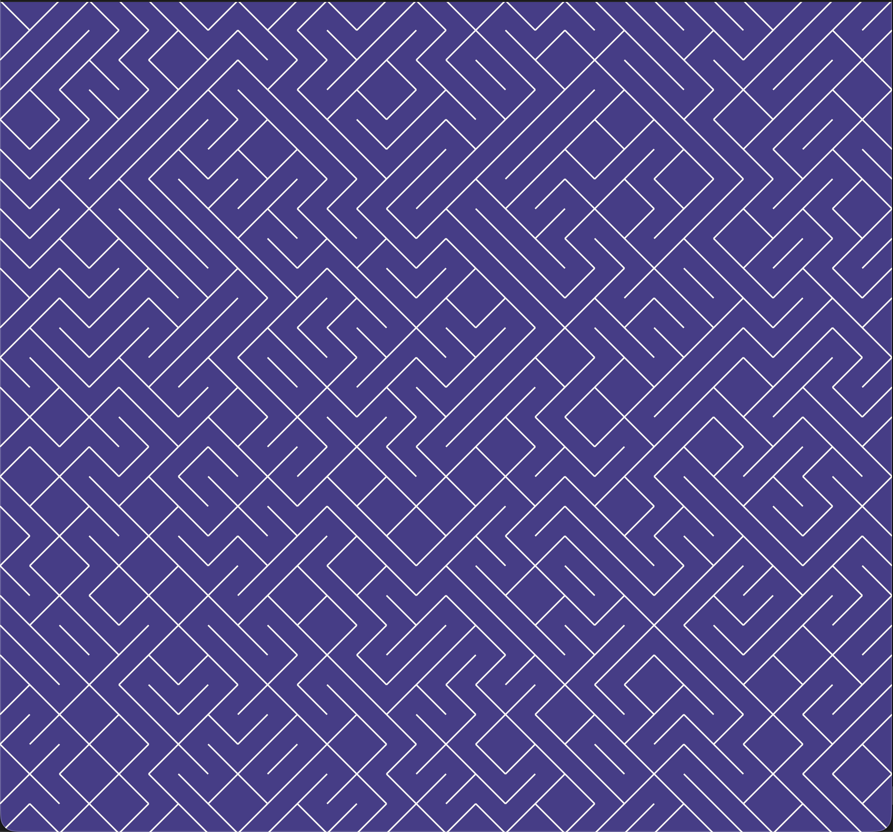

# 10PRINT Maze

10PRINT Maze is a creative coding tutorial inspired by [10 PRINT](https://www.youtube.com/watch?v=m9joBLOZVEo). A single-line piece of creative code published in 2012 by Casey Reas and various other artists. The code for this was first published in the 1980’s for the commodore 64 computer and in it’s original form it was only 3 lines. It was later optimized to a single line of code procedurally printing an endless maze on screen. Inspired by this simple, yet elegant piece of code, we will implement our own version. Fair warning, this will not be a single line of code. ;-)

<!-- {"width":654} -->

This tutorial assumes you have basic knowledge of Rust, you have read the [Rust Programming Language](https://doc.rust-lang.org/stable/book/) at least partially and completed the [Nannou Tutorials](https://guide.nannou.cc/tutorials) . We encourage you to follow along on your own to get the most benefits from this tutorial. We assume you know how to get up and running within your own environment. In this tutorial we use ‘Cargo Workspaces’ to expand our creative artwork step by step creating a new crate for each step. This comes with a few handy tricks that you will see later on.

We have increased the difficulty of this tutorial incrementally in each part. This is done to increase your learning curve and to no repeat ourselves every step of the way, so if you are stuck at a certain step, please apply every lesson from the previous step to your current step before continuing along.

Next follows an small outline of what we will be doing in each version of 10PRINT Maze:

**Part 1:** In this part we create a  one-time basic Nannou sketch that randomly generates a maze. This part of 10PRINT Maze teaches you the following:
1. Familiarize yourself with the basic Nannou sketch architecture, library and prelude.
2. Learn how to set up our window, grid and coordinate system.
3. Learn how to draw lines, set colors and pseudo-randomly generate a maze.

**Part 2:** In this part we add keyboard controls and redraw an existing maze. This version of 10PRINT Maze teaches you the following:
1. How to create a Nannou App and how it differs from a Sketch.
2. How to add basic keyboard controls to your app.
3. How to redraw the maze.

**Part 3:** In this part we randomly select a color and recolor the maze. This version teaches you the following:
1. How to add randomly generated colors to our drawing.
2. How to redraw and recolor our maze using keyboard controls.

**Part 4:** In this part we update our randomness and add GUI elements to change the parameters of our maze. This version teaches you the following:
1. How to add seeded randomness to our drawing and coloring functions.
2. How to add and use on-screen controls with Egui.

**Part 5:** This version teaches you about Nannou’s way of animating and transitioning. This version teaches you the following
1. How to create a transition for our walls.
2. How to update our transitions over time with using the keyboard and onscreen controls.# 10PRINT_Maze
